# Dashboard de Vendas na Nuvem

Sistema serverless na AWS que recebe arquivos de vendas (CSV/Excel), processa e armazena
os dados na nuvem, e apresenta um dashboard com:

- Total de vendas
- Faturamento
- Produtos mais vendidos
- Clientes (top clientes por receita)
- Vendas por cidade
- Gráficos (evolução do faturamento, receita por categoria, vendas por canal)

## Arquitetura

```mermaid
flowchart LR
    A[CSV / Excel] -->|upload| B[(S3\nbucket de ingestão)]
    B -->|evento ObjectCreated| C[Lambda\nIngestão]
    C -->|grava itens| D[(DynamoDB\ntabela vendas)]
    D -->|scan / query| E[Lambda\nAPI]
    E -->|proxy| F[API Gateway\nHTTP API]
    F -->|GET /dashboard| G[Dashboard\nHTML + Chart.js]

    style A fill:#1C2331,stroke:#4CE0C4,color:#E7ECF5
    style B fill:#1C2331,stroke:#FFB25B,color:#E7ECF5
    style C fill:#1C2331,stroke:#4CE0C4,color:#E7ECF5
    style D fill:#1C2331,stroke:#FFB25B,color:#E7ECF5
    style E fill:#1C2331,stroke:#4CE0C4,color:#E7ECF5
    style F fill:#1C2331,stroke:#FFB25B,color:#E7ECF5
    style G fill:#1C2331,stroke:#4CE0C4,color:#E7ECF5
```



**Fluxo de dados:**

1. Um arquivo `.csv`, `.xlsx` ou `.xls` com vendas é enviado ao bucket S3, dentro da pasta `uploads/`.
2. O evento de upload dispara automaticamente a **Lambda de Ingestão**, que lê o arquivo,
   valida as colunas obrigatórias e grava cada linha como um item no **DynamoDB**.
3. O **API Gateway** expõe a rota `GET /dashboard`, que aciona a **Lambda de API**.
4. A Lambda de API faz a leitura da tabela, agrega os dados (totais, top produtos, top clientes,
   vendas por cidade, série temporal, etc.) e devolve um JSON.
5. O **dashboard** (front-end estático) consome esse JSON e renderiza os cartões e gráficos.

## Estrutura do repositório

```
sales-dashboard-cloud/
├── README.md
├── infra/                    # Infraestrutura como código (Terraform)
│   ├── main.tf                # provider + backend
│   ├── variables.tf
│   ├── s3.tf                  # bucket de ingestão
│   ├── dynamodb.tf            # tabela de vendas
│   ├── lambda.tf              # as duas funções Lambda
│   ├── api_gateway.tf         # HTTP API + rota /dashboard
│   ├── iam.tf                 # roles e policies com privilégio mínimo
│   └── outputs.tf
├── lambda/
│   ├── ingest/
│   │   ├── handler.py          # parser de CSV/Excel -> DynamoDB
│   │   └── requirements.txt
│   └── api/
│       └── handler.py          # agregação DynamoDB -> JSON do dashboard
├── dashboard/
│   ├── index.html               # front-end (HTML + CSS + Chart.js, sem build step)
│   └── dados_demo.json          # dados de exemplo para rodar o dashboard offline
└── sample-data/
    └── vendas_exemplo.csv       # arquivo de exemplo para testar a ingestão
```

## Formato dos dados de entrada

O CSV (ou Excel) enviado ao S3 deve conter as colunas abaixo (nessa ordem ou não, os nomes é que importam):

| coluna          | exemplo               | descrição                        |
|-----------------|------------------------|-----------------------------------|
| id_venda        | V1005                  | opcional, gerado automaticamente se ausente |
| data            | 2026-05-01              | data da venda (AAAA-MM-DD)        |
| cliente         | Ana Beatriz Souza       | nome do cliente                   |
| cidade          | Recife                  | cidade da venda                   |
| uf              | PE                       | estado                            |
| produto         | Notebook Gamer X15       | nome do produto                   |
| categoria       | Eletrônicos              | categoria do produto              |
| quantidade      | 2                        | unidades vendidas                 |
| valor_unitario  | 4899.90                  | preço unitário praticado          |
| valor_total     | 9799.80                  | quantidade × valor_unitario       |
| canal           | Site                     | Site, App, Marketplace, Loja Física |

Um arquivo pronto para teste está em `sample-data/vendas_exemplo.csv`.

## Como rodar o dashboard localmente (modo demonstração)

Sem precisar de nenhuma conta AWS, o dashboard já funciona com dados de exemplo:

```bash
cd dashboard
python3 -m http.server 8000
# abra http://localhost:8000
```

Isso carrega `dados_demo.json`, que tem exatamente o mesmo formato devolvido pela Lambda de API,
então trocar para dados reais é apenas configurar a URL — veja o próximo passo.

## Como fazer o deploy da infraestrutura real (AWS)

Pré-requisitos: conta AWS configurada (`aws configure`) e [Terraform](https://developer.hashicorp.com/terraform/install) instalado.

```bash
cd infra
terraform init
terraform plan
terraform apply
```

Ao final, o Terraform mostra três outputs:

- `bucket_ingestao` — nome do bucket S3 para envio dos arquivos
- `dynamodb_table` — nome da tabela DynamoDB
- `api_endpoint` — URL da API que o dashboard deve consumir

### Testando a ingestão

```bash
aws s3 cp ../sample-data/vendas_exemplo.csv s3://<bucket_ingestao>/uploads/vendas_exemplo.csv
```

Isso dispara a Lambda de ingestão automaticamente. Acompanhe os logs em CloudWatch
(`/aws/lambda/vendas-dashboard-ingest-dev`).

### Conectando o dashboard à API real

Em `dashboard/index.html`, edite a constante no início do `<script>`:

```js
const API_URL = "https://SEU-ENDPOINT.execute-api.us-east-1.amazonaws.com/prod/dashboard";
```

Depois, publique `dashboard/index.html` como site estático (por exemplo em outro bucket S3 com
hosting estático habilitado, ou no Amplify/CloudFront) e o dashboard passa a exibir dados reais.

## Suporte a arquivos Excel (.xlsx)

A Lambda de ingestão usa a biblioteca `openpyxl` para ler arquivos `.xlsx`. Como o runtime padrão
da Lambda não inclui essa dependência, é necessário empacotá-la como uma **Lambda Layer**:

```bash
mkdir -p layer/python
pip install -r lambda/ingest/requirements.txt -t layer/python
cd layer && zip -r ../openpyxl-layer.zip python && cd ..
aws lambda publish-layer-version \
  --layer-name openpyxl-layer \
  --zip-file fileb://openpyxl-layer.zip \
  --compatible-runtimes python3.12
```

Depois, associe o ARN da layer publicada à função `aws_lambda_function.ingest` no Terraform
(`layers = ["arn:aws:lambda:...:layer:openpyxl-layer:1"]`).

## Escalando além do MVP

O handler da API faz um `scan` completo da tabela a cada requisição — ótimo para portfólio e
para volumes pequenos/médios, mas vale evoluir para produção:

- **Rollups incrementais**: a cada ingestão, atualizar contadores agregados (total do dia,
  por produto, por cidade) em vez de recalcular tudo a cada leitura.
- **GSIs adicionais**: já existe um índice por `cidade`; adicionar um por `data` acelera
  consultas de período sem scan completo.
- **Cache**: colocar o API Gateway atrás de um cache (5–10 min) reduz custo e latência
  para um dashboard que não precisa ser 100% real-time.
- **Athena + S3**: para históricos muito grandes, manter o S3 como data lake e consultar
  via Athena, mantendo o DynamoDB apenas para os dados mais recentes.

## Stack

- **Infra**: Terraform, AWS S3, Lambda (Python 3.12), DynamoDB, API Gateway (HTTP API)
- **Front-end**: HTML, CSS, JavaScript puro + Chart.js (sem build step, fácil de hospedar em qualquer lugar)
